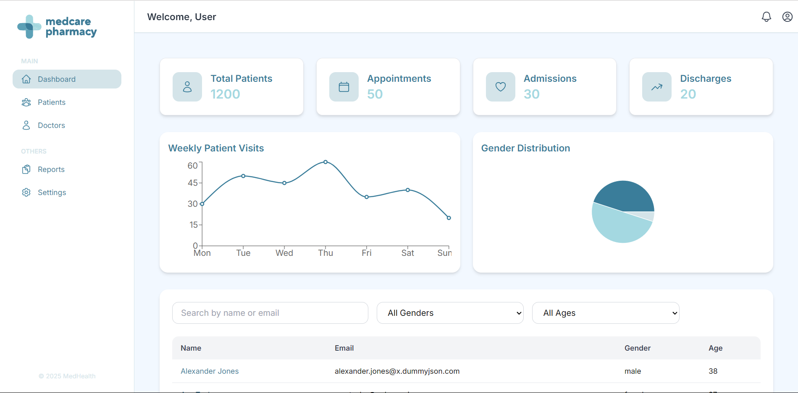
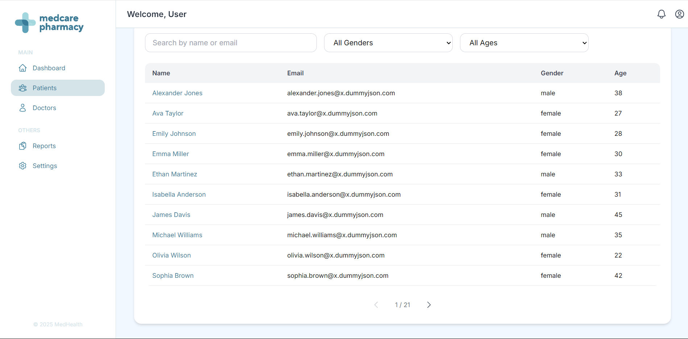
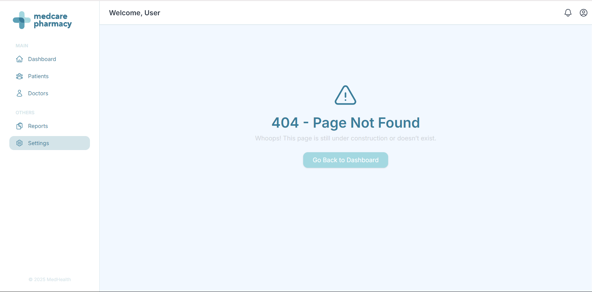

# Project Name: **Hospital Dashboard App**

## Description

This project is a hospital management dashboard application that provides an overview of patient statistics and patient details. The app is built using **React**, **TypeScript**, **TailwindCSS**, and follows a **modular architecture** to ensure scalability, maintainability, and performance optimization.

## Highlights

- **Modular architecture**: Cleanly structured by features/components
- **Type safety**: Implemented with TypeScript
- **UI**: Built with ShadCN, TailwindCSS, and Heroicons
- **State management**: Redux Toolkit with RTK Query
- **Charts & Data Visualizations**: Bar, Line, and Pie Charts
- **Accessibility**: Used `aria-label`, `alt` attributes, and semantic elements

## Dev Practices

- Created **feature branches** for modular development
- Followed **clean Git commit** practices with meaningful messages
- Opened **Pull Requests** with detailed descriptions and screenshots for review
- Maintained a clean and traceable Git history

## Project Architecture

- **Modular Folder Structure**:
  - `components/` – Reusable UI components (charts, cards, etc.)
  - `data/` – Static JSON data files
  - `hooks/` – Custom React hooks
  - `layouts/` – Layout components (e.g., dashboard layout)
  - `pages/` – Main route pages
  - `redux/` – Redux slices and RTK Query setup
  - `routes/` – App routes (if using route-based navigation)
  - `types/` – TypeScript interfaces and types
  - `utils/` – Utility/helper functions

## Installation

1. Clone the repository:
   ```bash
   git clone https://github.com/shubhaaaaaaa/dashboard-app.git
   ```

2. Navigate to the project directory:
   ```bash
   cd dashboard-app
   ```

3. Install the dependencies:
   ```bash
   npm install
   ```

4. Run the development server:
   ```bash
   npm run dev
   ```

5. Open the app in your browser:
   ```
   http://localhost:5173/
   ```

## Screenshots

Below are some screenshots of the project:

1. **Dashboard View**:
   

2. **Patient Data**:
   

3. **Error Handling**:
   

## Performance Optimizations

- **Lazy loading**: Non-critical components and images are lazy-loaded to improve initial load time.
- **Accessibility**: ARIA labels and alt texts are used across the app to improve accessibility for users with disabilities.

## Get in Touch

Feel free to reach out to me through any of the platforms below:

**Website:** [shubhakhadgi.com](https://shubhakhadgi.com.np)  
**LinkedIn:** [linkedin.com/in/shubhakhadgi](https://linkedin.com/in/shubhakhadgi)  
**Instagram:** [@strokes_byshubha](https://instagram.com/strokes_byshubha)  
**Email:** [shubhakhadgi.work@gmail.com](mailto:shubhakhadgi.work@gmail.com)  
**Phone:** +977-9802490382
